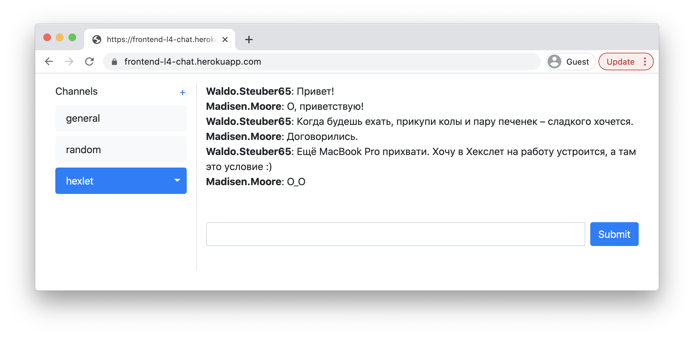
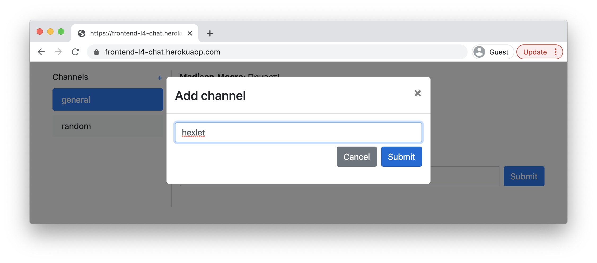

<div align="center">
  
  
</div>

<div align="center">

[](https://github.com/dmytro-komlyk/hexlet-chat-react/actions/workflows/hexlet-check.yml)
[](https://github.com/dmytro-komlyk/hexlet-chat-react/actions/workflows/nodejs.yml)

</div>

## About Chat

This is a simple real-time chat application.

- Registration and authorization.
- Create, rename and delete channels. These operations take place inside modals.
- Create and receive messages. Implemented via websockets.
- All forms validation and error handling. Used by formik.

## About project

This pet-project was created as part of the [Hexlet](https://ru.hexlet.io/programs/frontend/projects/12) curriculum.

## Tech Stack

- [React (with hooks)](https://reactjs.org/), [Redux Toolkit](https://redux-toolkit.js.org/), [React-Bootstrap](https://react-bootstrap.github.io/), [socket.io](https://socket.io/), [formik](https://formik.org/), [i18next](https://react.i18next.com/)
- [ESLint](https://eslint.org/), [Webpack](https://webpack.js.org/), [Heroku](https://dashboard.heroku.com/), [Rollbar](https://rollbar.com/)

## Requirements

- [Node (v.13+)](https://nodejs.org/en/)

## Getting started

```sh
git clone https://github.com/dmytro-komlyk/hexlet-chat-react.git
cd hexlet-chat-react/
make install
make start
```

## Demo

[](https://hexlet-chat-react.herokuapp.com/)
